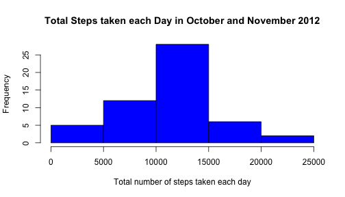
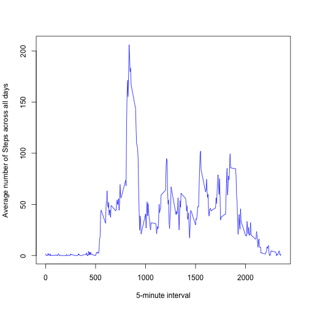
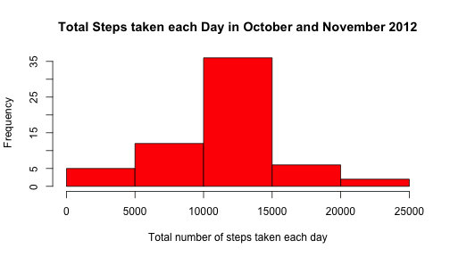
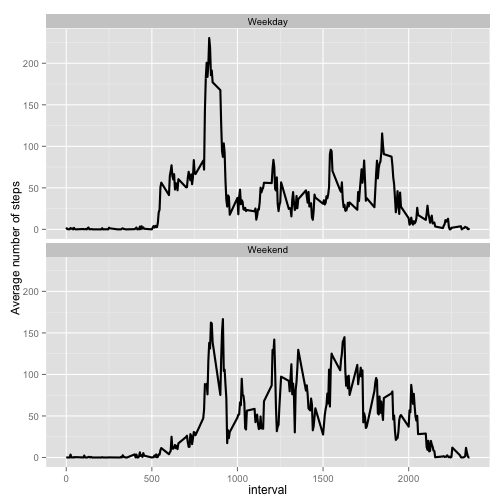

## Loading and preprocessing the data

```r
## Read the data
activity <- read.csv("./activity.csv")
head(activity)
```

```
##   steps       date interval
## 1    NA 2012-10-01        0
## 2    NA 2012-10-01        5
## 3    NA 2012-10-01       10
## 4    NA 2012-10-01       15
## 5    NA 2012-10-01       20
## 6    NA 2012-10-01       25
```

```r
## convert the date column to type Date
activity$date <- as.Date(activity$date, "%Y-%m-%d")
str(activity)
```

```
## 'data.frame':	17568 obs. of  3 variables:
##  $ steps   : int  NA NA NA NA NA NA NA NA NA NA ...
##  $ date    : Date, format: "2012-10-01" "2012-10-01" ...
##  $ interval: int  0 5 10 15 20 25 30 35 40 45 ...
```


## What is mean total number of steps taken per day?

##### Calculating the total number of steps taken per day

```r
totalStepsPerDay <- aggregate(steps ~ date, activity, sum , na.rm = TRUE)
head(totalStepsPerDay)
```

```
##         date steps
## 1 2012-10-02   126
## 2 2012-10-03 11352
## 3 2012-10-04 12116
## 4 2012-10-05 13294
## 5 2012-10-06 15420
## 6 2012-10-07 11015
```

##### Histogram of the total number of steps taken each day

```r
hist(totalStepsPerDay$steps,
     main = "Total Steps taken each Day in October and November 2012",
     xlab = "Total number of steps taken each day",
     col = "blue")
```

 

##### Calculating and reporting the mean and median of the total number of steps taken per day

```r
mean(totalStepsPerDay$steps)
```

```
## [1] 10766.19
```

```r
median(totalStepsPerDay$steps)
```

```
## [1] 10765
```


## What is the average daily activity pattern?

##### Time series plot of the 5-minute interval and the average number of steps taken, averaged across all days

```r
## Find the average number of steps taken (across all days) per 5-minute interval
meanPerInterval <- aggregate(steps ~ interval, activity, mean, na.rm = TRUE)
head(meanPerInterval)
```

```
##   interval     steps
## 1        0 1.7169811
## 2        5 0.3396226
## 3       10 0.1320755
## 4       15 0.1509434
## 5       20 0.0754717
## 6       25 2.0943396
```

```r
## Plot the graph 
plot(meanPerInterval$interval, meanPerInterval$steps , type = "l",
     xlab = "5-minute interval", ylab = "Average number of Steps across all days", col = "Blue")
```

 

##### Find which 5-minute interval, on average across all the days in the dataset, contains the maximum number of steps

```r
i <- which.max(meanPerInterval$steps)
meanPerInterval[i,]
```

```
##     interval    steps
## 104      835 206.1698
```

##### Interval 835 has the maximum number of steps (206)

## Imputing missing values

##### Calculate the total number of rows with NAs

```r
sum(is.na(activity))
```

```
## [1] 2304
```

##### Fill Missing values with mean of that 5-minute interval

```r
## Create a new data frame
activityComplete <- activity
## iterate over the activityComplete data frame
## to fill in the missing values
for (j in 1:nrow(activityComplete)) {
  s <- activityComplete[j, "steps"]
  ## check if NA
  if (is.na(s)) {
    ## Get the interval
    intvl <- activityComplete[j, "interval"]
    ## Get the mean steps for the interval across all days
    ## from the earlier computation above.
    m <- meanPerInterval[meanPerInterval$interval == intvl, "steps"]
    ## assign the mean to the missing value
    activityComplete[j, "steps"] <- m
  }
}
head(activityComplete)
```

```
##       steps       date interval
## 1 1.7169811 2012-10-01        0
## 2 0.3396226 2012-10-01        5
## 3 0.1320755 2012-10-01       10
## 4 0.1509434 2012-10-01       15
## 5 0.0754717 2012-10-01       20
## 6 2.0943396 2012-10-01       25
```

##### Plot the histogram of total number of steps taken each day with the new data frame

```r
## Aggregate the total steps per day using the new data frame
totalStepsPerDayImputed <- aggregate(steps ~ date, activityComplete, sum)
hist(totalStepsPerDayImputed$steps,
     main = "Total Steps taken each Day in October and November 2012",
     xlab = "Total number of steps taken each day",
     col = "red")
```

 

##### Calculating and reporting the mean and median of the total number of steps taken per day using new data frame

```r
mean(totalStepsPerDayImputed$steps)
```

```
## [1] 10766.19
```

```r
median(totalStepsPerDayImputed$steps)
```

```
## [1] 10766.19
```

##### Impact of imputing missing data
##### Before imputing , the mean and median were 10766.19 and 10765 respectively.
##### After filling the missing values , the mean is still the same ( 10766.19) but the median (10766.19) has shifted and is now exactly equal to the mean. 


## Are there differences in activity patterns between weekdays and weekends?

##### Create a new factor variable with two levels "weekday" and "weekend"

```r
w <- c("Sat","Sun")
activityComplete$day <- ifelse(weekdays(activity$date, abbr=TRUE) %in% w, "Weekend", "Weekday")
activityComplete$day <- as.factor(activityComplete$day)
str(activityComplete)
```

```
## 'data.frame':	17568 obs. of  4 variables:
##  $ steps   : num  1.717 0.3396 0.1321 0.1509 0.0755 ...
##  $ date    : Date, format: "2012-10-01" "2012-10-01" ...
##  $ interval: int  0 5 10 15 20 25 30 35 40 45 ...
##  $ day     : Factor w/ 2 levels "Weekday","Weekend": 1 1 1 1 1 1 1 1 1 1 ...
```

```r
## Aggregate per interval and day(weekend or weekday)
t <- aggregate(steps ~ interval + day, activityComplete, mean, na.rm = TRUE)

## Plot the graph
library(ggplot2)
ggplot(t, aes(x=interval, y=steps)) + geom_line(size=1) + facet_wrap(~ day, nrow=2, ncol=1) + ylab("Average number of steps")
```

 

##### The highest activity peak is on a weekday. The activities on weekends seem more spread out compared to weekdays.
##### There are more intervals on weekends where the number of steps are greater than or almost equal to 100 compared to weekdays.


